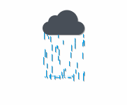

# 一、简介

复制忍者卡卡西通过他超强的学习能力和智慧，以及最重要的写轮眼，使它可以在战斗中使他能够在战斗中迅速地复制其他忍者的忍术，并进行反击。

而我将继承他的意志，将各种炫酷的前端效果封装为Web Components ，即浏览器原生支持的组件化方案，让你可以随时引入，随时使用。


# 二、示例

两步：

- 引入组件对应的js文件
- 使用该组件

```html
<!DOCTYPE html>
<html lang="zh-CN">

<head>
    <meta charset="UTF-8">
    <meta name="viewport" content="width=device-width, initial-scale=1.0">
    <title>Document</title>
    <!-- 引入该组件 -->
    <script src="RainCloud.js"></script>
    <style>
        * {
            margin: 0;
            padding: 0;
            box-sizing: border-box;
        }

        body {
            display: flex;
            justify-content: center;
            align-items: center;
            height: 100vh;
            background: #fff;
        }
    </style>
</head>

<body>
    <!-- 使用该组件 -->
    <rain-cloud style="--cloud-height:30px; --cloud-width:30px;"></rain-cloud>

</body>

</html>
```


# 三、组件详情

##### [rain-cloud]([Kakashi-UI/Components/RainCloud.js at master · Dr-Kaisa/Kakashi-UI](https://github.com/Dr-Kaisa/Kakashi-UI/blob/master/Components/RainCloud.js))

一朵一直下雨的小云



| 属性           | 说明 |
| -------------- | ---- |
| --cloud-height | 高度 |
| --cloud-width  | 宽度 |

PS：建议宽高比：1比1


PS：为什么没有注释？因为大部分都是一些博主为了装b些写的...他们自己都不写注释，我只是封装而已