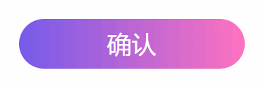

# 一、简介

复制忍者卡卡西通过他超强的学习能力和智慧，以及最重要的写轮眼，使它可以在战斗中使他能够在战斗中迅速地复制其他忍者的忍术，并进行反击。

而我将继承他的意志，将各种炫酷的前端效果封装为Web Components ，即浏览器原生支持的组件化方案，让你可以随时引入，随时使用。


# 二、示例

通常分为两步

### 1、使用组件

如果是组件的话，只需要：

- 引入组件对应的js文件
- 使用该组件

```html
<!DOCTYPE html>
<html lang="zh-CN">

<head>
    <meta charset="UTF-8">
    <meta name="viewport" content="width=device-width, initial-scale=1.0">
    <title>Document</title>
    <!-- 引入该组件 -->
    <script src="RainCloud.js"></script>
    <style>
        * {
            margin: 0;
            padding: 0;
            box-sizing: border-box;
        }

        body {
            display: flex;
            justify-content: center;
            align-items: center;
            height: 100vh;
            background: #fff;
        }
    </style>
</head>

<body>
    <!-- 使用该组件 -->
    <rain-cloud style="--cloud-height:30px; --cloud-width:30px;"></rain-cloud>

</body>

</html>
```

### 2、使用样式

如果是样式，只需要：

- 引入样式文件
- 然后在目标元素上加上样式属性

```html
<!DOCTYPE html>
<html lang="en">

<head>
    <meta charset="UTF-8">
    <meta name="viewport" content="width=device-width, initial-scale=1.0">
    <title>Document</title>
    <!-- 样式文件要操作dom，因此通过defer引入 -->
    <script defer src="styles/highLight.js"></script>
    <style>
        body {


            max-width: 600px;
            margin: 80px auto;

            font-size: 1.5rem;
            font-family: Helvetica;
            background-color: #020617;
            color: #94a3b8;
        }

        .any {
            font-size: 40px;
        }
    </style>
</head>

<body>

    <div kakashi-highlight class="any"> <!-- 只需添加该属性即可 -->
        Lorem ipsum dolor sit, amet consectetur adipisicing elit.
    </div>
    <div kakashi-highlight style="--lighting-color: orange; --lighting-highlight-color: yellow;">
        可自定义渐变颜色
    </div>
    <script>

    </script>

</body>

</html>
```


# 三、组件详情

##### [rain-cloud]([Kakashi-UI/Components/RainCloud.js at master · Dr-Kaisa/Kakashi-UI](https://github.com/Dr-Kaisa/Kakashi-UI/blob/master/Components/RainCloud.js))

一朵一直下雨的小云


| 属性     | 说明 |
| -------- | ---- |
| --height | 高度 |
| --width  | 宽度 |

PS：建议宽高比：1比1


##### [ripple-button]([Kakashi-UI/Components/RippleButton.js at master · Dr-Kaisa/Kakashi-UI](https://github.com/Dr-Kaisa/Kakashi-UI/blob/master/Components/RippleButton.js))

波纹按钮，可自定义颜色和宽高



| 属性          | 说明         |
| ------------- | ------------ |
| --height      | 高度         |
| --width       | 宽度         |
| --start-color | 渐变起始颜色 |
| --end-color   | 渐变终止颜色 |


# 四、样式详情

##### kakashi-highlight

悬停聚光灯样式，可作用于元素内的所有文本

| 属性                       | 说明         |
| -------------------------- | ------------ |
| --lighting-color           | 默认字体颜色 |
| --lighting-highlight-color | 高亮颜色     |


PS：为什么没有注释？因为大部分都是一些博主为了装b些写的...他们自己都不写注释，我只是封装而已